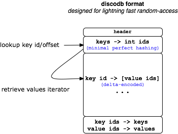

:mod:`discodb` -- An efficient, immutable, persistent mapping object
====================================================================

`discodb` is comprised of a low-level data structure implemented in C,
and a high-level :class:`discodb.DiscoDB` class which exposes a dict-like
interface for using the low-level data structure from Python. In contrast to
Python's builtin dict object, DiscoDB can handle tens of millions of
key-value pairs without consuming gigabytes of memory.

In addition to basic key-value mappings, DiscoDB supports evaluation of
Boolean queries expressed in :term:`Conjunctive Normal Form` (see
:class:`discodb.Q` below). All queries are evaluated lazily using iterators,
so you can handle gigabytes of data in Python with ease.

DiscoDBs are :term:`persistent`, which means that once created in memory,
they can be easily compressed, serialized and written to a file.  The benefit
of this is that after they have been persisted, instantiating them from disk
and key lookups are lightning-fast operations, thanks to `memory mapping
<http://en.wikipedia.org/wiki/Memory-mapped_file>`_.

DiscoDBs are also :term:`immutable`, which means that once they are created,
they cannot be modified. A benefit of immutability is that the full key-space
is known when DiscoDB is built, which makes it possible to use `perfect
hashing <http://en.wikipedia.org/wiki/Perfect_hash_function>`_ for fast
*O(1)* key lookups. Specifically, DiscoDB relies on the `CMPH library
<http://cmph.sourceforge.net/>`_ for building minimal perfect hash functions.

DiscoDB compresses values first by replacing duplicate entries with references
to a singe unique entry and then by compressing unique entries with a fast
compression algorithm based on `Huffman Coding
<http://en.wikipedia.org/wiki/Huffman_coding>`_. The main benefit of this
approach is that each value can be random accessed efficiently while achieving
reasonable compression ratios, thanks to statistics collected from all the data.
This means that you can have lots of redundancy, e.g. common prefixes, in your
values without having to worry about space consumption.

The format of a DiscoDB file essentially looks like this:

The benefits of these properties are realized when you need repeated,
random-access to data, especially when the dataset is too large to fit in
memory at once. DiscoDBs are a key component in Disco's builtin distributed
indexing system, :ref:`discodex`

Install
-------

DiscoDB does not depend on Disco in any way, although it is a core
component in :ref:`discodex`. You can use it without Disco as a general-purpose
scalable, immutable datastructure for Python. To install only DiscoDB without
rest of Disco, clone Disco, and run::

    make install-discodb

or if you just want to build it locally::

    cd contrib/discodb
    python setup.py build

DiscoDB requires `CMPH library v0.9 or newer
<http://cmph.sourceforge.net/>`_ (``libcmph-dev`` in Debian).

Example
-------

Here is a simple example that builds a simple discodb and queries it::

    from discodb import DiscoDB, Q

    data = {'mammals': ['cow', 'dog', 'cat', 'whale'],
            'pets': ['dog', 'cat', 'goldfish'],
            'aquatic': ['goldfish', 'whale']}

    db = DiscoDB(data) # create an immutable discodb object

    print list(db.keys()) # => mammals, aquatic, pets
    print list(db['pets']) # => dog, cat, goldfish
    print list(db.query(Q.parse('mammals & aquatic'))) # => whale
    print list(db.query(Q.parse('pets & ~aquatic'))) # => dog, cat
    print list(db.query(Q.parse('pets | aquatic'))) # => dog, cat, whale, goldfish

    db.dump(file('animals.db', 'w')) # dump discodb to a file

For more detailed information on querying, see :mod:`discodb.query`.

Notes
-----

- DiscoDB stores only one copy of each unique value. Thus using the same
  value multiple times is very cheap. Applications should utilize this feature
  to maximize space and time efficiency.

- DiscoDB sorts key-value pairs internally, so no pre-sorting is needed. You can
  request DiscoDB to remove duplicate key-value pairs automatically by setting
  ``unique_items=True`` in the DiscoDB constructor.

- DiscoDB does not compress values which are smaller than four bytes. DiscoDB may
  also decide to disable compression if it is not likely to be beneficial.
  This doesn't affect in DiscoDB behavior in any way. You can
  disable compression explicitly, e.g. if your values are already compressed, by
  setting ``disable_compression=True`` in the DiscoDB constructor.

- Value lists can be empty, in which case DiscoDB becomes an efficient set
  data structure.

- Keys and values can be arbitrary byte sequences or strings (see size limitations
  below). For instance, you can save a serialized DiscoDB, as produced by
  :meth:`discodb.DiscoDB.dumps`, in another DiscoDB to build a tree of
  DiscoDBs!

- If any of the keys contains duplicate values, the whole DiscoDB is tagged to
  contain `multisets <http://en.wikipedia.org/wiki/Multiset>`_. In the multiset
  mode :meth:`discodb.DiscoDB.query` is not available, as it is not clear
  currently how duplicate values should be handled in queries. However, looking up a
  single key works as usual, so applications can freely utilize the multiset
  feature (which is very efficient, as noted above) if complex queries are not needed.

- A single DiscoDB object has the following limitations:
    - Maximum number of keys, 2\ :sup:`32`
    - Maximum number of unique values, 2\ :sup:`32`
    - Maximum number of values, 2\ :sup:`64`
    - Maximum size of a key/value, 2\ :sup:`32` bytes (4G)
    - Maximum size of a DiscoDB object, 2\ :sup:`64` bytes

  In many cases it makes sense to have several (distributed) small or
  medium-size DiscoDBs with millions of keys at most, as created by
  :ref:`discodex`, instead of having a single DiscoDB with hundreds
  of millions of keys and values, although it is technically possible.
  Run your own benchmarks to find the optimal size for your application.

Python API
----------

.. automodule:: discodb
   :members:
