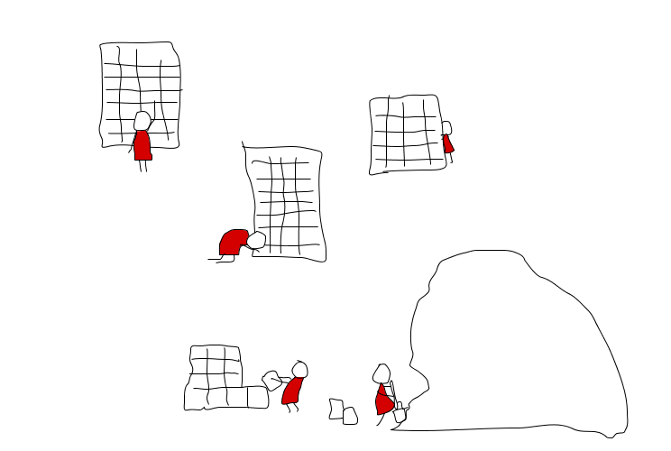
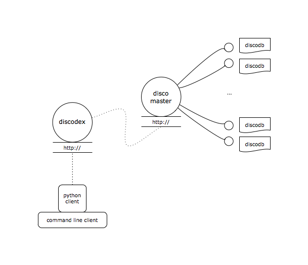

.. _discodex:

Discodex
========

.. contents::

Overview
--------

A crucial step in building data-driven systems, is indexing the data in such
a way that it is accessible in constant time.
Such random access is essential for building real-time systems, but also
valuable in optimizing many other applications which rely upon lookups
into the data.
Discodex builds on top of Disco, abstracting away some of the most common
operations for organizing piles of raw data into :term:`indices <index>`,
and querying them.
Discodex adopts a similar strategy to Disco in achieving this goal:
making the interface simple and intuitive, so that development time isn't
an excuse for not building an index.

In other words, Discodex is a distributed `(key, values)` storage system.
Discodex makes it easy to build and query indices using real-world datasets,
especially when such indices would be too large to fit on a single machine.

.. note::

    The term `values` is intentionally plural above.
    A core feature of an indexing system is that you generally want to retrieve
    *all* `values` which have some property in common (i.e. the `key`).

Architecture
------------

When you run Discodex, you are running an `HTTP`_ server which maps
`ReSTful`_ URIs to Disco jobs.
Discodex stores keys and values in indices using :ref:`DDFS`.
The individual files which are distributed, are called
`index chunks` or :term:`ichunks <ichunk>`.
Discodex uses a custom data structure/file format for storing `ichunks`,
called a :mod:`discodb`.

The overall architecture looks like this:

The Discodex server exposes a :doc:`ReST API <api/rest>`,
which the :mod:`discodexcli` client utilizes.
Anyone can leverage the API to build a thin-client for accessing
resources stored in Discodex.
For instance, web applications can make normal `HTTP` requests
(which are executing :ref:`Disco <disco>` jobs behind the scenes),
to query massive datasets.

.. _HTTP: http://www.w3.org/Protocols
.. _ReSTful: http://en.wikipedia.org/wiki/Representational_State_Transfer
