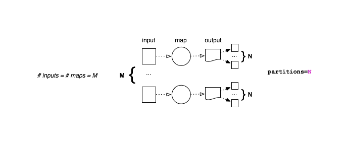

.. _dataflow:

Data Flow in Disco Jobs
=======================

Disco allows the chaining together of jobs containing
:term:`map` and/or :term:`reduce` phases.
`Map` and `Reduce` phases each have their own concepts of data flow.
Through combinations of chained jobs, Disco supports a remarkable
variety of data flows.

Understanding data flow in Disco requires understanding the core concept of :term:`partitioning`.
Map results in Disco can be either `partitioned` or `non-partitioned`.
For partitioned output, the results Disco returns are index files,
which contain the URLs of each individual output partition:

.. figure:: ../images/dataflow/partitioned_file.png

In the diagrams below, it should be clear when Disco is relying on
either reading partitioned input or writing partitioned output.

The overall data flow in a classic Disco job is controlled by four
:class:`disco.worker.classic.worker.Worker` parameters.
The presence of ``map`` and ``reduce``, determine the overall structure of the job
(i.e. whether its `mapreduce`, `map-only`, or `reduce-only`).
The ``partitions`` parameter determines whether or not the map output is partitioned,
and the number of partitions.
The ``merge_partitions`` parameter determines whether partitioned input to reduce is merged.

Map Flows
---------

The two basic modes of operation for the map phase correspond directly
to writing either partitioned or non-partitioned output.

.. _partitioned_map_flow:

Partitioned Map
'''''''''''''''

For partitioned map, each output is written to one of the partitions:

.. _non-partitioned_map_flow:

Non-Partitioned Map
'''''''''''''''''''

For non-partitioned map, *every* map task creates a single output.
In other words, the input-output relationship is exactly `1 to 1`:

.. _one_partition_map_flow:

Single-Partition Map
''''''''''''''''''''

Notice that for partitioned output with ``N`` partitions, **exactly** ``N``
files will be created *for each node*, *regardless of the number of maps*.
If the map tasks run on ``K`` nodes, exactly ``K * N`` files will be created.
Whereas for non-partitioned output with ``M`` inputs,
exactly ``M`` output files will be created.

This is an important difference between partitioned output with 1 partition,
and non-partitioned output:

.. figure:: ../images/dataflow/one_partition_map_flow.png

The default number of partitions for map is 1.
This means that by default if you run ``M`` maps on ``K`` nodes,
you end up with ``K`` files containing the results.
In older versions of Disco, there were no partitions by default,
so that jobs with a huge number of inputs produced a huge number of outputs.
If ``M >> K``, this is suboptimal for the reduce phase.

Reduce Flows
------------

The basic modes of operation for the reduce phase correspond to
partitioned/non-partitioned input (instead of output as in the map phase).

.. _normal_partitioned_reduce_flow:

Normal Partitioned Reduce Flow
''''''''''''''''''''''''''''''

.. figure:: ../images/dataflow/normal_partitioned_reduce_flow.png

As you might expect, the default is to distribute the reduce phase.

.. _non-partitioned_reduce_flow:

Non-Partitioned Reduce
'''''''''''''''''''''''

For non-partitioned input, there can only ever be 1 reduce task:

.. figure:: ../images/dataflow/non-partitioned_reduce_flow.png

The situation is slightly more complicated for partitioned input,
as there is a choice to be made whether or not to merge the partitions,
so that all results are handled by a single reduce:

.. _merge_partitioned_reduce_flow:

Merge Partitioned Reduce
''''''''''''''''''''''''

.. figure:: ../images/dataflow/merge_partitioned_reduce_flow.png

Or to use the normal, distributed reduce,
in which there are ``N`` reduces for ``N`` partitions:
