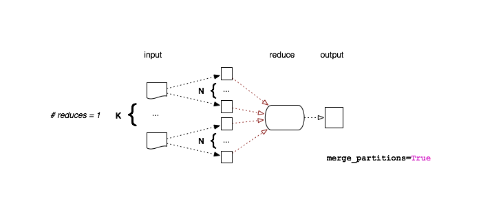

.. _dataflow:

Data Flow in Disco Jobs
=======================

.. figure:: ../images/dataflow/partitioned_file.png

   Partitioned File Structure

Map Flows
---------

.. _non-partitioned_map_flow:

.. figure:: ../images/dataflow/non-partitioned_map_flow.png

   Non-Partitioned Map

.. _partitioned_map_flow:

.. figure:: ../images/dataflow/partitioned_map_flow.png

   Partitioned Map

.. _one_partition_map_flow:

.. figure:: ../images/dataflow/one_partition_map_flow.png

   Single-Partition Map

Reduce Flows
------------

.. _non-partitioned_reduce_flow:

.. figure:: ../images/dataflow/non-partitioned_reduce_flow.png

   Non-Partitioned Reduce Flow

.. _merge_partitioned_reduce_flow:

   Merge Partitioned Reduce Flow

.. _normal_partitioned_reduce_flow:

.. figure:: ../images/dataflow/normal_partitioned_reduce_flow.png

   Normal Partitioned Reduce Flow
