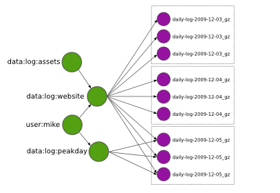

.. _ddfs:

Disco Distributed Filesystem
============================

.. contents::

Introduction
------------

Disco Distributed Filesystem (DDFS) provides a distributed storage layer
for Disco. DDFS is designed specifically to support use cases that are
typical for Disco and :term:`mapreduce` in general: Storage and processing
of massive amounts of immutable data. This makes it very suitable for
storing, for instance: log data, large binary objects (photos, videos, indices),
or incrementally collected raw data such as web crawls.

In this sense, DDFS is complementary to traditional relational databases
or distributed key-value stores, which often have difficulties in scaling
to tera- or petabytes of bulk data. Although DDFS stands for Disco
Distributed *filesystem*, it is not a general-purpose POSIX-compatible
filesystem. Rather, it is a special purpose storage layer similar to `the
Google filesystem <http://labs.google.com/papers/gfs.html>`_ or related
open-source projects such as `Hadoop Distributed Filesystem (HDFS)
<http://hadoop.apache.org/hdfs/docs/current/hdfs_design.html>`_,
`MogileFS <http://danga.com/mogilefs/>`_ or `Tabled
<https://hail.wiki.kernel.org/index.php/Tabled>`_.

DDFS is a low-level component in the Disco stack, taking care of data
*distribution*, *replication*, *persistence*, *addressing* and *access*.
It does not provide a sophisticated query facility in itself but it is
**tightly integrated** with Disco :term:`jobs <job>`.
Disco can store job results to DDFS,
providing persistence for and easy access to processed data.

DDFS is a **tag-based** filesystem: Instead of having to organize data
to directory hierarchies, you can tag sets of objects with arbitrary
names and retrieve them later based on the given :term:`tags <tag>`.
For instance, tags can be used to timestamp different versions of
data, or denote the source or owner of data.  Tags can contain links
to other tags, and data can be referred to by multiple tags; tags
hence form a network or a directed **graph of metadata**.
This provides a flexible way to **manage terabytes** of data assets.
DDFS also provides a mechanism to store arbitrary attributes with the tags,
for instance, to denote data type.

DDFS is **schema-free**, so you can use it to store arbitrary,
non-normalized data. However, it is not suitable for storing data items
that are very small (fewer than 4K) or that need to be updated often,
such as user passwords or status indicators. You can store frequently
changing data in a key-value store or a relational database.
If you need to analyze this data with Disco, you can dump a snapshot
of the full database to DDFS, for instance, to update your user models
every night.

DDFS is **horizontally scalable**. New nodes can be added to the storage
cluster on the fly, using the Disco web UI. All heavy IO on bulk data
is distributed, so there are no bottlenecks limiting the amount of data
that DDFS can handle. Only metadata is handled centrally, ensuring
that it is kept **consistent** all the time.

DDFS is designed to operate on commodity hardware. **Fault-tolerance**
and **high availability** are ensured by K-way replication of both data
and metadata, so the system tolerates *K-1* simultaneous hardware
failures without interruptions. DDFS stores data and metadata on normal
local filesystems, such as `ext3` or `xfs`, so even under a catastrophic
failure data is recoverable using standard tools.

Concepts
--------

DDFS operates on two concepts: :ref:`blobs` and :ref:`tags`.

.. _blobs:

Blobs
'''''

Blobs are arbitrary objects (files) that have been pushed to DDFS.
They are distributed to storage nodes and stored on their local
filesystems.  Multiple copies or replicas are stored for each blob.

.. _tags:

Tags
''''

Tags contain metadata about blobs. Most importantly, a tag contains a
list of URLs (one for each replica) that refer to blobs that have been
assigned this tag. Tag may also contain links to other tags. It may
also include user-defined metadata.

The next section describes the role of tags and blobs in more
detail. It also shows how they relate to the five main tasks of DDFS,
data *distribution*, *replication*, *persistence*, *addressing* and
*access*.

Overview
--------

Consider that you have a log file containing data of a single day.

For DDFS, this is a blob. When you push the blob to DDFS using
:ref:`ddfsapi`, a DDFS client **distributes** the blob to K nodes.

.. image:: ../images/ddfs-concept-2.png

By default, K is 3, so you get three identical **replicas** of the blob.
DDFS and Disco can utilize any of the replicas, in case some of them
are unavailable due to disk or server failure. DDFS ensures that
you will always have K replicas, even if disks fail, by re-replicating
blobs if needed. This guarantees that your data is truly **persistent**.

Even persistent data is not very valuable if it cannot be accessed
easily. The blobs distributed above are stored on three random nodes. To
be able to use them efficiently, metadata storing **addresses** of the
blobs is needed. DDFS uses tags for this purpose.

.. image:: ../images/ddfs-concept-3.png

The green tag allows you to query data behind `data:log:website` using
:ref:`ddfsapi` and retrieve a tag object that contains URLs to the
blobs. You can **access** the blobs using their URLs over HTTP as usual,
or give the list to Disco to be used as inputs for a Map/Reduce job.
Naturally metadata should not be lost under any circumstances, so
tags are replicated and distributed to many nodes similarly to blobs.

Each blob *must* have at least one tag linking to it. Otherwise the blob
is practically unaccessible or *orphaned*. Orphaned blobs are eventually
deleted by the garbage collector. Correspondingly, if you want to delete
a set of blobs from DDFS, you must delete all links (or tags) referencing
the blobs which makes them orphaned and subject to eventual removal.

.. image:: ../images/ddfs-concept-4.png

Eventually you want to add more daily logs (blobs) under the tag `data:log:website`.
Each daily log is replicated separately, so the tag ends up containing many
*replication sets*, that is, lists of URLs that pointing at replicas of a blob.
Replications sets are represented by dotted boxes above.

DDFS allows tags to reference other tags. This is a very powerful
feature which makes it possible to implement tag hierarchies and graphs.
For instance, the tag `user:mike` above links to all tags owned by Mike.
:ref:`ddfsapi` provides functions to traverse the tag graph, so it is
straightforward to retrieve all tags and blobs owned by Mike.

Tags may also reference overlapping sets of blobs, as in
`data:log:peakday` above. This feature is useful if you want to provide
many alternative views to the same data. DDFS is designed to scale to millions
of tags, so you can use them without hesitation.

Tags also support a token-based authorization mechanism to control
read and write access.  If a write-token is specified for a tag, all
operations that wish to modify the tag will need to provide this
write-token.  Without this token, any write operation will return an
"unauthorized" error.  Similarly, a read-token can be used to control
accesses that read the tag.  Read and write tokens can be
independently specified.

When a token is specified for an operation that creates a new tag,
that token becomes the new tag's read and write token.  This allows
the atomic creation of access-controlled tags.

In addition to being a container of metadata about blobs, a tag can
also contain a limited number of user-defined attributes, each with a
name and a string value.

Implementation
''''''''''''''
.. image:: ../images/ddfs-arch.png

DDFS is embedded in Disco, hence the architecture diagram above closely
resembles that of Disco (see :ref:`overview`). DDFS is currently coordinated
by a single master node, similar to Disco itself. This choice was motivated by
the ease of implementation and robustness, following experiences of the first
version of `the Google filesystem <http://labs.google.com/papers/gfs.html>`_.
As no data is stored on the master node, it is not a single point of failure
with respect to data persistence. It mainly acts as a lock server, ensuring
atomicity of metadata operations.

Each storage node contains a number of disks or volumes (`vol0..volN`),
assigned to DDFS by mounting them under ``DDFS_DATA/vol0`` ...
``DDFS_DATA/volN`` (see :envvar:`DDFS_DATA`).
On each volume, DDFS creates two directories,
``tag`` and ``blob``, for storing tags and blobs, respectively. DDFS
monitors available disk space on each volume on regular intervals for
load balancing. New blobs are stored to the least loaded volumes.

Each storage node maintains a cache of all tags stored on the node. When the
master node receives a request accessing a yet unseen tag, it queries the
storage nodes to find all replicas of the tag. Thanks to the cache, this
operation is reasonably fast. Similarly, if the master node crashes and restarts,
re-populating the master cache takes only some seconds.

All tag-related operations are handled by the master, to ensure their
atomicity and consistency. The client may push new blobs to DDFS by
first requesting a set of URLs for the desired number of replicas from
the master. After receiving the URLs, the client can push the blobs
individually to the designated URLs using HTTP PUT requests. After
pushing all replicas successfully to storage nodes, the client can tag
the blobs by making a tag request to the master with a list of URLs to
the newly created blobs.

If the client fails to push all *K* replicas to storage nodes, it can
request a new set of URLs from the master, excluding the failed nodes.
This approach is enabled by default in the DDFS Python API. The client
can also decide to accept only *M* replicas, where *M < K*, if this is
sufficient for the application. If the master detects that a node has
become unresponsive, it is automatically blacklisted and dropped from
subsequent queries. Thanks to replicated data and metadata, this does
not result in any data loss.

A regular garbage collection process makes sure that the required number of
replicas is maintained, orphaned blobs are deleted and deleted tags are
eventually removed from the system. The desired number of replicas is defined in
the configuration file, see :mod:`disco.settings` for details.

Blobs can be accessed either over HTTP, using DDFS's built-in web server on each
storage node, or directly on local disk. The latter feature is heavily utilized
by Disco, which prefers to run tasks on the nodes where data is physically
stored, to minimize network traffic.

The token-based authorization scheme is implemented using the basic
access authentication scheme of HTTP, as described in `RFC 2617
<http://tools.ietf.org/html/rfc2617.html#section-2>`_.

Settings
''''''''

DDFS can be configured using the normal Disco settings file. See
:mod:`disco.settings`.

.. _ddfsapi:

DDFS APIs
---------

Python API
''''''''''

DDFS can be used either through the native Web API or with a Python
module, :mod:`disco.ddfs`, which hides the Web API behind Python
functions.

Web API
'''''''

We assume below that the Disco master can be found at ``http://disco:8989``. All
responses by the Web API are encoded in `JSON <http://json.org>`_.

**Add a new blob**

GET ``http://disco:8989/ddfs/new_blob/BLOB[?replicas=N&exclude=NODE1,NODE2..]``

Requests PUT URLs for a new blob. The blob is given a prefix ``BLOB``. You can
use the same prefix for any number of blobs, each call to ``new_blob`` generates
a new version of the blob. ``BLOB`` must match the character class ``[A-Za-z0-9_\-@:]+``.

Optionally, you can request URLs for ``N`` replicas. However, currently DDFS
only guarantees that the minimum number of replicas (``DDFS_BLOB_REPLICAS``)
specified in the settings file is maintained.

You can also specify a list of nodes, ``NODE1`` etc., to exclude from the
returned list of URLs.

Returns a list of URLs on storage nodes where the blob can be pushed using
HTTP PUT requests.

**Add blobs to a tag**

POST ``http://disco:8989/ddfs/tag/TAG``

Appends a list of URLs or replication sets to a tag TAG. If TAG doesn't exist,
it is created. ``TAG`` must match the character class ``[A-Za-z0-9_\-@:]+``
(same as with ``BLOB`` above).

The request body must be a JSON-encoded message of the form

``[["http://node1/blob1", "http://node2/blob1"], ["http://node1/blob2"...]]``

which lists the replication sets to be added to the tag. Typically, this request
is made after successfully pushing blobs to storage nodes. In this case, the
list of URLs is the list received from storage nodes, in response to the HTTP PUT
calls.

Alternatively, you can specify

``[["tag://sometag1"], ["tag://sometag2"]]``

to add links to existing tags.

Returns a list of tag URLs.

**Return a tag**

GET ``http://disco:8989/ddfs/tag/TAG``

Returns contents of the tag ``TAG``. The returned object is a JSON-encoded
dictionary. It contains the following items:

   * ``id`` Versioned tag ID
   * ``version`` Version of the tag object
   * ``last-modified`` When the tag was last modified
   * ``urls`` List of URLs to tags and/or blobs

**Replace contents of a tag**

PUT ``http://disco:8989/ddfs/tag/TAG``

Similar to POST ``tag`` above but replaces the existing list of URLs instead of
appending URLs to it. The request follows the same format as POST ``tag``.

**Delete a tag**

DELETE ``http://disco:8989/ddfs/tag/TAG``

Delete the tag ``TAG``. Note that blobs referenced by the tag are removed only
when **all** references to the blobs are removed. If several tags link to the
blobs, deleting a single tag does not affect the blobs.

**List all tags**

GET ``http://disco:8989/ddfs/tags[/PREFIX0/PREFIX1...]``

Returns all tags stored in DDFS. As the returned list of tags can be
potentially really long, tags can be filtered by prefix.

Special syntactic sugar is provided for filtering hierarchically named tags,
that is, tags with prefixes separated by colons. You can query a certain prefix
by replacing colons with slashes in the URL. For instance, all tags starting with
``data:log:website`` can be found with

``http://disco:8989/ddfs/tags/data/log/website``

which is equal to

``http://disco:8989/ddfs/tags/data:log:website``

**Set an attribute on a tag**

PUT ``http://disco:8989/ddfs/tag/TAG/ATTR``

Sets the ATTR attribute of the tag TAG to a value VAL, where VAL is
the request body.  If the attribute did not exist, it is created; if
it did exist, its value is overwritten.  ATTR must match the character
class ``[A-Za-z0-9_\-@:]+``, while VAL should be a UTF8 string.

**Get a tag attribute**

GET ``http://disco:8989/ddfs/tag/TAG/ATTR``

Retrieves the value of the ATTR attribute of the tag TAG.  The value
is returned in the request body.

**Delete a tag attribute**

DELETE ``http://disco:8989/ddfs/tag/TAG/ATTR``

Deletes the ATTR attribute of the tag TAG.  No error is returned if
the tag does not possess the attribute ATTR.

**Token-based Authorization**

A token for a tag operation is provided in an Authorization header
field for the corresponding HTTP request. The userid for the HTTP
basic credential is set to the string ``token``, and the token is used
as the value of the password.  For example, the operation to retrieve
the tag TAG protected by the read-token TOKEN will look like

GET ``http://disco:8989/ddfs/tag/TAG``
Authorization: ``Basic dG9rZW46VE9LRU4=``

where "dG9rZW46VE9LRU4=" is the base64 encoding of "token:TOKEN".

Tokens are stored in tags as attributes in a separate ``ddfs:``
namespace; i.e. the read-token is stored as the ``ddfs:read-token``
attribute of the tag, while the write-token is the
``ddfs:write-token`` attribute.  Hence, the above-described calls to
get, set, and delete attributes can also be used to perform the
corresponding operations on a tag's read and write tokens.

Internals
---------

This section provides information about DDFS internals, supplementing
comments in the source code. This discussion is mainly interesting to
developers and advanced users of DDFS and Disco.

As one might gather from the sections above, metadata (tag) operations
are the central core of DDFS, mainly due to their transactional nature.
Another non-trivial part of DDFS is re-replication and garbage
collection of tags and blobs. These issues are discussed in more detail
below.

Blob operations
'''''''''''''''

Operations on blobs are reasonably simple.  The client is responsible
for pushing data to storage nodes, using HTTP PUT requests.
``new_blob`` returns a list of URLs, based on the available disk
space, to which the blob data can be PUT.  A node receiving data via a
PUT first creates a temporary !partial file into which the blob is
received, and then renames the file into the blobname on successful
completion.

Getting a blob is just a matter of making a normal HTTP GET request.

Tag operations
''''''''''''''

Tags are the only mutable data type in DDFS. Each tag update creates a
new version of the tag; the latest version of the tag is used to get
the current contents of the tag. Updating data in a
distributed system is a non-trivial task. Classical solutions
include centralized lock servers, various methods based on
eventual consistency and consensus protocols such as `Paxos
<http://en.wikipedia.org/wiki/Paxos_algorithm>`_. Currently DDFS takes the
first centralized approach, which is straightforward to implement in a
single-master architecture.

All operations manipulating a tag are serialized, although many distinct
tags can be processed concurrently. Serialization is achieved by handling
each tag in a separate `gen_server` process, in ``ddfs/ddfs_tag.erl`` (tag
server). Tag servers are instantiated on demand basis, and killed after
a period of inactivity. Together, tag servers implement the master cache.

To get a tag, tag server queries all storage nodes to find all
versions of the tag (see ``ddfs/ddfs_tag:get_tagdata()``). From the list of
all available versions, it finds replicas of the latest tag version,
chooses one of them randomly, and retrieves the tag data. It is not safe
to get tag data if more than *K - 1* nodes are unavailable, as in this
case not all versions of the tag might be available.

After the tag data is received, it is manipulated depending on the requested
operation (GET, POST, PUT). After this, an updated version of the tag is
committed to DDFS. This is a critical operation, to ensure consistency of
metadata.

DDFS uses a modified `3-phase commit protocol
<http://en.wikipedia.org/wiki/Three-phase_commit_protocol>`_ to commit the tag
data back to storage nodes. The transaction proceeds as follows:

   1. Choose *K* destination nodes.
   2. Send the tag data to the chosen nodes, using a temporary filename.
   3. If the operation fails on a node, choose another node and retry.
   4. If all nodes fail before *K* replicas are written, abort.
   5. Once *K* temporary replicas are written successfully, make a call to
      rename temporary replicas to final replicas.
   6. If rename on any of the nodes succeed, the transaction succeeds, otherwise aborts.

All message passing between the storage nodes and the master is limited by a
timeout. Note that it is possible, under exceptional circumstances, that less
than *K* replicas are written due to lack of rollback functionality in the
last step. However, the client is informed about the number of replicas written,
so it can safely reissue the tag request, if it notices an insufficient number
of replicas. In any case, garbage collection process will recreate the missing
replicas eventually.

Tag delete
''''''''''

Deleting a tag is a non-trivial operation. Obviously deleting just the newest
version of the tag is insufficient, as this would merely resurface a previous
version. Deleting all versions of the tag is not very robust, as it is very
likely that a temporarily unavailable node might contain a version of the
tag, which would resurface once the node becomes available again.

DDFS uses a special tag (metatag) ``+deleted`` (inaccessible to the
user due to the plus sign), to list deleted tags. Each tag operation
checks whether the requested tag exists on this list, to hide deleted
tags from the user. Actual deletion is handled by garbage collector in
``ddfs/ddfs_gc_main:process_deleted()``.

The deleted tag is kept on the ``+deleted`` list until all known versions of
the tag have been garbage collected, and a sufficient quarantine period has
passed since the last seen version, to ensure that all nodes which might be
temporarily unavailable have been restarted.

Due to this mechanism, it is critical that no node stays unavailable for more
than ``?DELETED_TAG_EXPIRES`` (see ``ddfs/config.hrl``) days before restarting.
The period is currently one month.

.. _gcrr:

Garbage collection and Re-replication
'''''''''''''''''''''''''''''''''''''

A central background process implements garbage collection and
re-replication, ensuring the consistency and persistence of data and
metadata in DDFS. It takes care of the following tasks:

   * Remove leftover !partial. files (from failed PUT operations).
   * Remove orphaned tags (old versions and deleted tags).
   * Remove orphaned blobs (blobs not referred by any tag).
   * Recover lost replicas for non-orphaned blobs (from lost tag updates)
   * Deleted old deleted tags from the ``+deleted`` metatag.
   * Re-replicate blobs that do not have enough replicas.
   * Update tags that contain blobs that were re-replicated, and/or
     re-replicate tags that don't have enough replicas.

Garbage collection and re-replication are documented at the beginning
of ``ddfs/ddfs_gc_main.erl``.  They are performed only when the
cluster is in a safe state with respect to :ref:`ft`, i.e. there are
fewer than *K* failed nodes in the cluster.

.. _ft:

Fault tolerance
'''''''''''''''

DDFS piggybacks on Disco on fault-tolerance. It relies on Disco's
``node_mon.erl`` to monitor availability of nodes, and to blacklist
unavailable nodes.

Currently many operations are set to fail if more than *K - 1* nodes
are down at the same time. Given *K*-way replication, this policy gives
a good guarantee that the returned data is always consistent. However,
in a large cluster (say, more than 100 nodes), it is quite possible to
have more than two nodes down (with the default 3-way replication) at any
point of time. Increasing *K* when the cluster grows is not a good option,
as this would be wasteful and it would increase latencies unnecessarily.

One possible solution to this issue is to restrict node operations to a subset
of nodes instead of all of them. This would mean that the *K - 1* limit of
failed nodes is imposed on a fixed subset of nodes, which is a very reasonable
assumption on a cluster of any size. The node space could be partitioned using a
consistent hashing mechanism, which could be integrated to ``ddfs/ddfs_tag.erl``
without major changes in the overall architecture of DDFS.
