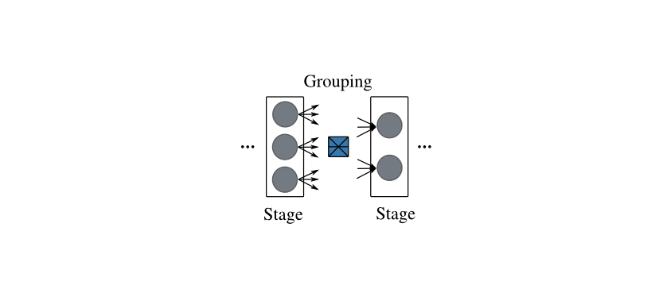
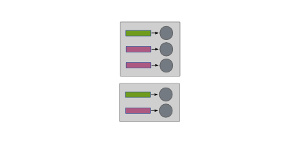
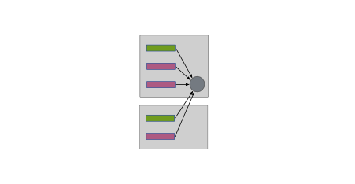
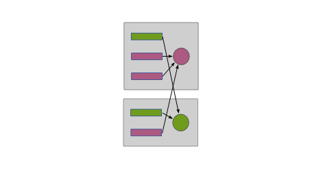

.. _pipeline:

Pipeline Data Flow in Disco Jobs
================================

The dataflow and computation in a Disco job is structured as a
`pipeline`, where a pipeline is a linear sequence of `stages`, and the
outputs of each stage are grouped into the inputs of the subsequent
stage.

The high-level idea of a pipeline is shown below:

It can also be represented succinctly as follows::

   pipeline  ::=  stage+
   stage     ::=  {grouping, task}

A :term:`stage <stage>` consists of a set of :term:`tasks <task>` that
perform the same computation, but on different inputs.  For example, a
`map` stage can consist of a set of `Map` tasks, each of which takes
in a single input, whereas a `reduce` stage typically consists of a
single `Reduce` task that can process all the inputs to the `reduce`
stage.

A :term:`grouping <grouping>` operation specifies how the inputs to a
stage are divided into inputs for the tasks that belong to that stage.
The grouping of a set of inputs is performed using the :term:`label`
attached to each input.

The outputs generated by the tasks in a stage become the inputs for
the tasks in the subsequent stage of the pipeline.  Whenever a task
generates an output file, it attaches an integer :term:`label` to that
file.  These labeled outputs become the labeled inputs for the
grouping operation performed by the subsequent stage.

In other words, a `pipeline` is a sequence of `stages`, and each
`stage` performs a `grouping` of its `labeled` inputs into one
or more `groups`.  Each such `group` of inputs is processed by a
single `task`, whose definition is part of the definition of the
stage.

There are five different grouping operations that the user can choose
for a stage: ``split``, ``group_node``, ``group_label``,
``group_node_label``, and ``group_all``.  Each of these operations
take in a set of inputs, and group them using the labels attached to
each input and the cluster node on which the input resides.  (Note:
inputs not residing on a known cluster node, e.g. those that are
specified using ``http://`` URLs that point outside the cluster, are
currently treated as residing on a single fictitious cluster node.)

The simplest ones are ``split``, ``group_all`` and ``group_label``,
since they do not take into account the cluster node on which the
inputs reside, so lets explain them first.

The ``split`` operation puts each input into its own group, regardless
of the label of the input, or the cluster node on which it resides.
The grey boxes below indicate the cluster nodes on which the inputs
reside.

The ``group_all`` operation puts all inputs into a single group, again
regardless of their labels or hosting cluster nodes.

On the other hand, the ``group_label`` operation takes into account
the labels, and puts all inputs with the same label into the same
group.

To illustrate the pipeline model, we can now use it to express a
simple Map-Reduce job::

    map-reduce = {split, <map>}, {group_label, <reduce>}

The first stage, `<map>`, of this pipeline puts each input to the
pipeline into its own group, and executes a `<map>` task with that
group as input.  Each `<map>` task produces a set of labeled outputs.
These labeled outputs become the labeled inputs of the `<reduce>`
stage.  This `<reduce>` stage puts all inputs with the same label into
a single group, and executes a `<reduce>` task that takes in each such
group as input.  Hence, the number of such `<reduce>` tasks is
determined by the number of distinct labels generated by the `<map>`
tasks in the `<map>` stage.  The labeled outputs generated by the
`<reduce>` tasks in the `<reduce>` stage become the outputs of the
`map-reduce` pipeline.  This shows how the normal :ref:`Partitioned
Reduce DataFlow <normal_partitioned_reduce_flow>` in earlier versions
of Disco can be implemented.

Let's now clarify one issue that might be raised at this point: the
inputs to the pipeline are not the outputs of a previous stage in the
pipeline, so what labels are attached to them?  The answer is that the
labels for the job inputs are derived from :ref:`jobpack` submitted to
Disco by the user, and hence are user-specified.  (However, see the
discussion of backward-compatibility issues in :ref:`jobpack`.)

