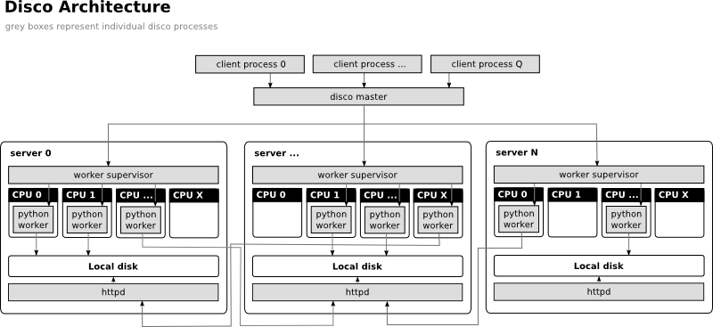

.. _overview:

Technical Overview
==================

Disco is based on the master-slave architecture.

 * The :term:`master` receives :term:`jobs <job>`, adds them to the job queue,
   and runs them in the cluster when nodes become available.

 * :term:`Client` programs submit jobs to the master.

 * :term:`Slaves <slave>` are started by the master on each node in the cluster.
   They spawn and monitor all processes that run on their respective nodes.

 * :term:`Workers <worker>` perform job :term:`tasks <task>`.
   The locations of their output results are sent to the master.

 * Once files are stored in the Disco cluster,
   Disco tries to maintain :term:`data locality` by scheduling tasks
   which use those files as input on the same nodes that the files are stored on.
   Disco runs an HTTP server on each node so that data can be accessed remotely,
   when a worker cannot be run on the same node that its input is located.

Users can limit the number of workers run in parallel on each node.
Thus, users can easily designate the cluster to run as many tasks
as there are available CPUs, disks, or any other number.

If high availability of the system is a concern, CPUs in the cluster can
be partitioned amongst arbitrary many Disco masters. This way several
Disco masters can co-exist, which eliminates the only single point of
failure in the system.
