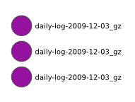
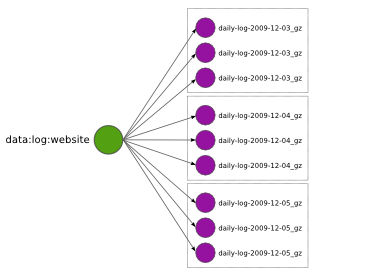
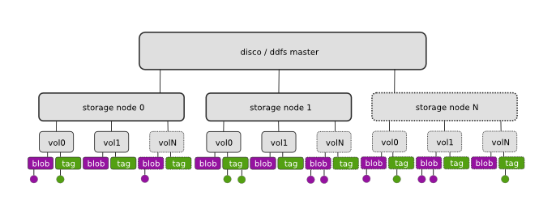

.. _ddfs:

Disco Distributed Filesystem
============================

.. contents::

Introduction
------------

Disco Distributed Filesystem (DDFS) provides a distributed storage layer
for Disco. DDFS is designed specifically to support use cases that are
typical for Disco and Map/Reduce in general: Storage and processing
of massive amounts of immutable data. This makes it very suitable for
storing, for instance, log data, large binary objects (photos, videos,
discodb indices), or incrementally collected raw data such as web
crawls. In this sense, DDFS is complementary to traditional relational
databases or distributed key-value stores, which often have difficulties
in scaling to terabytes of bulk data.

DDFS is a low-level component in the Disco stack, taking care of data
*distribution*, *replication*, *persistence*, *addressing* and *access*.
It does not provide a sophisticated query facility in itself but it is
**tightly integrated** with Disco jobs and Discodex indexing component,
which can be used to build application-specific query interfaces. Disco
can store results of Map/Reduce jobs to DDFS, providing persistence and
easy access for processed data.

DDFS is a **tag-based** filesystem: Instead of having to organize data
to directory hierarchies, you can tag sets of objects with arbitrary
names and retrieve them later based on the given tags. For instance,
tags can be used to timestamp different versions of data, or denote the
source or owner of data. Tags can contain links to other tags, which
form a network or a directed **graph of metadata**. This provides a
flexible way to **manage terabytes** of data assets. DDFS also provides
a mechanism to store arbitrary attributes with the tags, for instance,
to denote data type.

DDFS is **schema-free**, so you can use it to store arbitrary,
non-normalized data. However, it is not suitable for storing data items
that are very small (less than 4K) or that need to be updated often,
such as user passwords or status indicators. You can store frequently
changing data in a distributed key-value store or a relational database.
If you need to analyze this data with Disco, you can dump a snapshot
of the full database to DDFS, for instance, to update your user models
every night.

DDFS is designed to operate on commodity hardware. **Fault-tolerance**
and **high availability** is ensured by K-way replication of both data
and metadata, so the system tolerates *K-1* simultaneous hardware
failures without interruptions. DDFS stores data and metadata on normal
local filesystems, such as `ext3` or `xfs`, so even under a catastrophic
failure data is recoverable using standard tools.

Overview
--------

DDFS operates on two concepts: *blobs* and *tags*. Blobs are arbitrary
objects (files) that have been pushed to DDFS. They are distributed to
storage nodes and stored on the local filesystem as is.

Tags contain metadata about blobs. Most importantly, a tag contains a
list of URLs that refer to blobs that have been assinged this tag. Tag
may also contain links to other tags. It may also include user-defined
metadata.

Next section describes the role of tags and blobs more closely. It
also shows how they relate to the five main tasks of DDFS, data
*distribution*, *replication*, *persistence*, *addressing* and *access*.

Concepts
''''''''

Consider that you have a log file containing data of a single day. 

.. image:: ../images/ddfs-concept-1.png

For DDFS, this is a blob. When you push the blob to DDFS using
:ref:`ddfsapi`, DDFS **distributes** the blob to K nodes.

By default, K is 3, so you get three identical **replicas** of the blob.
DDFS and Disco can utilize any of the replicas, in case some of them
are unavailable due to disk or server failure. DDFS also ensures that
you will always have K replicas, even if disks fail, by re-replicating
blobs if needed. This guarantees that your data is truly **persistent**.

Even persistent data is not very valuable if it cannot be used. Blobs
distributed above are stored on random three nodes. To be able to use 
them efficiently, metadata storing **addresses** of the blobs is 
needed. DDFS uses tags (green circle below) for this purpose. 

.. image:: ../images/ddfs-concept-3.png

Now you can make a query for `data:log:website` using :ref:`ddfsapi`
to retrieve a tag object that contains URLs to the blobs. You can
**access** the blobs using their URLs over HTTP as usual, or give the
list to Disco to be used as inputs for a Map/Reduce job. Naturally also
metadata should not be lost under any circumstances, so also tags are
replicated and distributed to many nodes.

Each blob *must* have at least one tag linking to it. Otherwise the blob
is practically unaccessible or *orphaned*. Orphaned blobs are eventually
deleted by the garbage collector. Correspondingly, if you want to delete
a set of blobs from DDFS, you must delete all links (or tags) referencing
the blobs which makes them orphaned and subject to eventual removal.

Eventually you want to add more daily logs (blobs) under the tag `data:log:website`.
Each daily log is replicated separately, so the tag ends up containing many 
*replication sets*, that is, lists of URLs that all point to different replicas
of the same blob, represented by dotted boxes above.

.. image:: ../images/ddfs-concept-5.png

DDFS allows tags to reference other tags. This is a very powerful
feature which makes it possible to implement tag hierarchies and graphs.
Above, tag `user:mike` points at all tags owned by Mike. :ref:`ddfsapi`
provides functions to traverse the tag graph, so it easy to retrieve all
tags and blobs owned by Mike.

Tags may also reference overlapping sets of blobs, as in
`data:log:peakday` above. This feature is useful if you want to provide
many alternative views to the same data.

Implementation
''''''''''''''

DDFS is embedded in Disco, hence the architecture diagram above closely
resembles that of Disco (see :ref:`overview`). DDFS is currently coordinated
by a single master node, similar to Disco itself. This choice was motivated by
the ease of implementation and robustness, following experiences of the first
version of `the Google filesystem <http://labs.google.com/papers/gfs.html>`_.
As no data is stored on the master node, it is not a single point of failure
with respect to data persistence. It mainly acts as a lock server, ensuring
atomicity of metadata operations.

Each storage node contains a number of disks or volumes (`vol0..volN`),
assigned to DDFS by mounting them under ``$DDFS_ROOT/vol0`` ...
``$DDFS_ROOT/volN``. On each volume, DDFS creates two directories,
``tag`` and ``blob``, for storing tags anb blobs, respectively. DDFS
monitors available disk space on each volume on regular intervals for
load balancing. New blobs are stored to the least loaded volumes.

Each storage node maintains a cache of all tags stored on the node. When the
master node receives a request accessing a yet unseen tag, it queries the
storage nodes to find all replicas of the tag. Thanks to the cache, this
operation is reasonably fast. Similarly, if the master node crashes and restarts,
re-populating the master cache takes only some seconds.

All tag-related operations are handled by the master, to ensure their
atomicity and consistency. The client may push new blobs to DDFS by
first requesting a set of URLs for the desired number of replices from
the master. After receiving the URLs, the client can push the blobs
individually to the designated URLs using HTTP PUT requests. After
pushing all replicas successfully to storage nodes, the client can tag
the blobs by making a tag request to the master with a list of URLs to
the newly created blobs.

If the client fails to push all *K* replicas to storage nodes, it can
request a new set of URLs from the master, excluding the failed nodes.
This approach is enabled by default in the DDFS Python API. The client
can also decide to accept only *M* replicas, where *M < K*, if this is
sufficient for the application. If the master detects that a node has
become unresponsive, it is automatically blacklisted and dropped from
subsequest queries. Thanks to replicated data and metadata, this does
not result in any data loss.

A regular garbage collection process makes sure that the required number of
replicas is maintained, orphaned blobs are deleted and deleted tags are
eventually removed from the system. The desired number of replicas is defined in
the configuration file, see :ref:`ddfssettings` below for details.

Blobs can be accessed either over HTTP, using DDFS's built-in web server on each
storage node, or directly on local disk. The latter feature is heavily utilized
by Disco, which prefers to run tasks on the nodes where data is physically
stored, to minimize network traffic.

.. _ddfsapi:

DDFS API
--------

DDFS can be used either through the native Web API or with a Python
module, :mod:`disco.ddfs`, which hides the Web API behind Python
functions.

Web API
'''''''

We assume below that the Disco master can be found at ``http://disco:8989``. All
responses by the Web API are encoded in `JSON <http://json.org>`_.

**Add a new blob**

GET ``http://disco:8989/ddfs/new_blob/BLOB[?replicas=N&exclude=NODE1,NODE2..]``

Requests PUT URLs for a new blob. The blob is given a prefix ``BLOB``. You can
use the same prefix for any number of blobs, each call to ``new_blob`` generates
a new version of the blob. ``BLOB`` must match the character class ``[A-Za-z0-9_\-@:]+``.

Optionally, you can request URLs for ``N`` replicas. However, currently DDFS
only guarantees that the minimum number of replicas (``DDFS_BLOB_REPLICAS``)
specified in the settings file is maintained.

You can also specify a list of nodes, ``NODE1`` etc., to exclude from the
returned list of URLs.

Returns a list of URLs on storage nodes where the blob can be pushed using 
HTTP PUT requests.

**Add blobs to a tag**

POST ``http://disco:8989/ddfs/tag/TAG``

Appends a list of URLs or replication sets to a tag TAG. If TAG doesn't exist,
it is created. The request body must be a JSON-encoded message of the form

``[["http://node1/blob1", "http://node2/blob1"], ["http://node1/blob2"...]]``

which lists the replication sets to be added to the tag. Typically, this request
is made after successfully pushing blobs to storage nodes. In this case, the
list of URLs is the list received from storage nodes, in response to the HTTP PUT
calls.

Alternatively, you can specify

``[["tag://sometag1"], ["tag://sometag2"]]``

to add links to existing tags.

Returns a list of tag URLs. 

**Return a tag**

GET ``http://disco:8989/ddfs/tag/TAG``

Returns contents of the tag ``TAG``. The returned object is a JSON-encoded
dictionary. It contains the following items:

   * ``id`` Versioned tag ID
   * ``version`` Version of the tag object
   * ``last-modified`` When the tag was last modified
   * ``urls`` List of URLs to tags and/or blobs

**Replace contents of a tag**

PUT ``http://disco:8989/ddfs/tag/TAG``

Similar to POST ``tag`` above but replaces the existing list of URLs instead of
appending URLs to it. The request follows the same format as POST ``tag``.

**Delete a tag**

DELETE ``http://disco:8989/ddfs/tag/TAG``

Delete the tag ``TAG``. Note that blobs referenced by the tag are removed only
when **all** references to the blobs are removed. If several tags link to the
blobs, deleting a single tag does not affect the blobs.

**List all tags**

GET ``http://disco:8989/ddfs/tags[/PREFIX0/PREFIX1...]``

Returns all tags stored in DDFS. As the returned list of tags can be potentially really
long, tags can be filtered by prefix.

Special syntactic sugar is provided for filtering hierarchically named tags,
that is, tags with prefixes separated by colons. You can query a certain prefix
by replacing colons with slashes in the URL. For instance, all tags starting with
``data:log:website`` can be found with

``http://disco:8989/ddfs/tags/data/log/website/``

.. _ddfssettings:

Settings
''''''''

DDFS can be configured using the normal Disco settings file. See :ref:`settings`
for details.

Internals
---------

Write path
''''''''''

Read path
'''''''''

Delete
''''''

Fault tolerance
'''''''''''''''

Garbage collection
''''''''''''''''''
