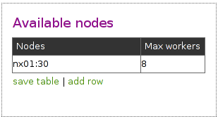

.. _setup:

Setting up Disco
================

This document helps you to install Disco from source,
either on a single server or a cluster of servers.
This requires installation of some :ref:`prereqs`.

.. seealso:: :ref:`install_sys`.

Background
----------

You should have a quick look at :ref:`overview` before setting up the system,
to get an idea what should go where and why.
To make a long story short, Disco works as follows:

 * Disco users start Disco jobs in Python scripts.
 * Jobs requests are sent over HTTP to the master.
 * Master is an :term:`Erlang` process that receives requests over HTTP.
 * Master launches :term:`slaves <slave>` on each node over :term:`SSH`.
 * Slaves run Disco tasks in :term:`worker` processes.

.. _prereqs:

Prerequisites
-------------

You need at least one Linux/Unix server.
Any distribution should work (including Mac OS X).

On each server the following are required:

 * `SSH daemon and client <http://www.openssh.com>`_
 * `Erlang/OTP R14A or newer <http://www.erlang.org>`_
 * `Python 2.6 or newer <http://www.python.org>`_

The same version of Erlang should be installed on all servers.

Optionally, ``DISCO_PROXY`` needs one of

 * `Lighttpd 1.4.17 or newer <http://lighttpd.net>`_
 * `Varnish 2.1.3 or newer <http://varnish-cache.org>`_

.. _install_source:

Install Disco
-------------

Short Version
'''''''''''''

::

        git clone git://github.com/discoproject/disco.git DISCO_HOME
        cd DISCO_HOME
        make
        bin/disco nodaemon

.. hint:: Its convenient to add the :mod:`disco <discocli>` command to your path.

Long Version
''''''''''''

Download :doc:`a recent version of Disco <download>`.

Extract the package (if necessary) and ``cd`` into it.
We will refer to this directory as :envvar:`DISCO_HOME`.

Now compile Disco::

        make

This is often the easiest and the least intrusive way to get started with Disco.

You should repeat the above command on all machines in your Disco cluster.

.. note:: Disco must be located at the same path on all the nodes.

To start the master and enter its Erlang shell,
without redirecting the log to a file, run::

   bin/disco nodaemon

To start the master as a daemon and log to a file, use::

   bin/disco start

.. hint:: If Disco has started up properly,
          you should be able to see its processes running::

              ps aux | grep beam.*disco

          If you don't see any Disco processes,
          you may want to try :ref:`troubleshooting`.

.. _configauth:

Configure Authentication
------------------------

Next we need to enable passwordless login via ssh to all servers in
the Disco cluster. If you have only one machine, you need to enable
passwordless login to ``localhost`` for the Disco user.

Run the following command as the Disco user, assuming that it doesn't
have valid ssh-keys already::

        ssh-keygen -N '' -f ~/.ssh/id_dsa

If you have one server (or shared home directories), say::

        cat ~/.ssh/id_dsa.pub >> ~/.ssh/authorized_keys

Otherwise, repeat the following command for all the servers ``nodeX``
in the cluster::

        ssh-copy-id nodeX

Now try to login to all servers in the cluster or ``localhost``, if you
have only one machine. You should not need to give a password nor answer
to any questions after the first login attempt.

As the last step, if you run Disco on many machines, you need to make
sure that all servers in the Disco cluster use the same `Erlang cookie`_,
which is used for authentication between Erlang nodes. Run the following
command as the Disco user on the master server::

        scp ~/.erlang.cookie nodeX:

Repeat the command for all the servers ``nodeX``.

.. warning:: The Erlang cookie must be readable only to the disco user.
             If it isn't, run ``chmod 400 ~/.erlang.cookie`` on all the nodes.

.. _Erlang cookie: http://www.erlang.org/doc/getting_started/conc_prog.html#id2264467

.. _confignodes:

Add nodes to Disco
------------------

At this point you should have Disco up and running.
The final step, before testing the system,
is to specify which servers are available for Disco.
This is done via Disco's web interface.

Point your browser at ``http://<DISCO_MASTER_HOST>:<DISCO_PORT>``,
where :envvar:`DISCO_MASTER_HOST` and :envvar:`DISCO_PORT` should be
replaced with their actual values.
Normally you can use `http://localhost:8989 <http://localhost:8989>`_,
if you run Disco locally or through an SSH tunnel.

You should see the Disco main screen (see :ref:`a screenshot <screenshots>`).
Click ``configure`` on the right side of the page.
On the configuration page, click ``add row`` to add a new set of available nodes.
Click the cells on the new empty row, and add hostname of an available server
(or a :ref:`range of hostnames <confignodes_multi>`) in the left cell,
and the number of available cores (CPUs) on that server in the right cell.
Once you have entered a value, click the cell again to save it.

.. warning::
    Keep in mind that for more than one node, hostnames need to resolve globally
    (e.g. you should be relying on DNS to resolve hostnames,
    **not** `/etc/hosts` on an individual machine).

    Hostnames used by Disco are shortnames, and not fully qualified
    hostnames.  DNS must be configured to correctly resolve the
    shortnames of the hostnames in the cluster.

    Disco cannot currently use raw IP addresses for hostnames.  Short
    DNS hostnames must be used to name cluster nodes.

    A relatively common mistake is that ``master`` is just an alias for the loopback address,
    such as ``localhost``, provided in `/etc/hosts` on the master machine.
    In such cases, some nodes may **not** be able to resolve the master properly:
    they may all resolve to themselves (if they all have the same hosts file),
    nothing at all, or different machines (if they are configured differently).

You can add as many rows as needed to fully specify your cluster,
which may have varying number of cores on different nodes.
Click ``save table`` when you are done.

Add the ``localhost``
'''''''''''''''''''''

If you have only a single machine, the resulting table should look like
this, assuming that you have two cores available for Disco:

.. warning:: It is not advised to use the :term:`master` as a :term:`slave` node
             in a serious Disco cluster.

.. _confignodes_multi:

Add multiple nodes in the same line
'''''''''''''''''''''''''''''''''''

You can also specify multiple nodes on a single line,
if the nodes are named with a common prefix, as here:

This table specifies that there are 30 nodes available in the cluster, from
``nx01`` to ``nx30`` and each node has 8 cores.

.. _insttest:

Test the System
---------------

Now Disco should be ready for use.

We can use the following simple Disco script that computes word
frequencies in `a text file <http://discoproject.org/media/text/chekhov.txt>`_
to see that the system works correctly.

.. literalinclude:: ../../examples/util/count_words.py
   :language: python

Run the script as follows from :envvar:`DISCO_HOME`::

        python examples/util/count_words.py

Disco attempts to use the current hostname as :envvar:`DISCO_MASTER_HOST`,
if it is not defined in any settings file.

If you are runing Disco on multiple machines you must use the same version of
Python for running Disco scripts as you use on the server side.

You can run the script on any machine that can access the master.
The safest bet is to test the script on the master node itself.

If the machine where you run the script can access the master node but
not other nodes in the cluster, you need to set :envvar:`DISCO_PROXY`.
The proxy address should be the same as the master's above.
This makes Disco fetch results through the master node,
instead of connecting to the nodes directly.

If the script produces some results, congratulations, you have a
working Disco setup!
If you are new to Disco, you might want to read the :ref:`tutorial` next.

If the script fails, see the section about :ref:`troubleshooting`.
